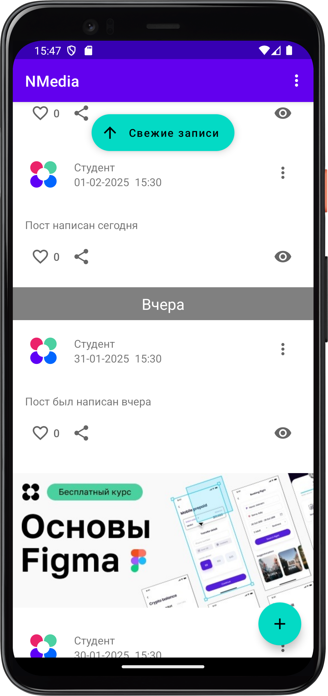
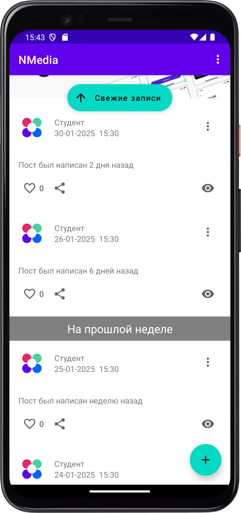
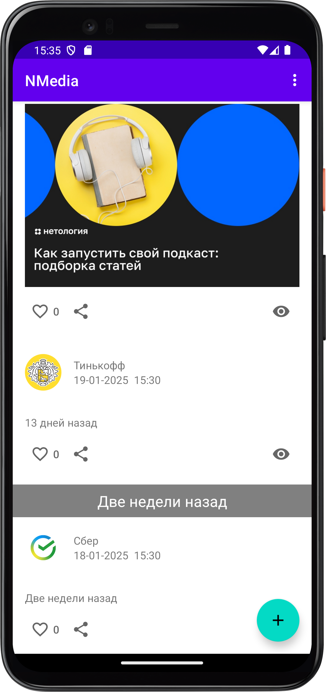
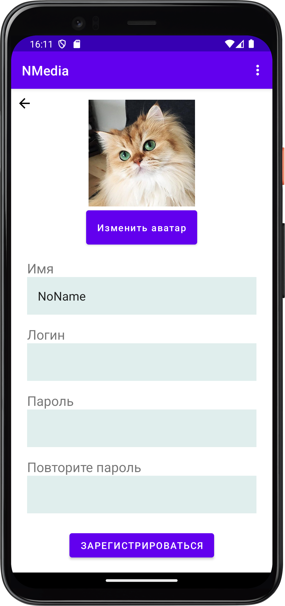
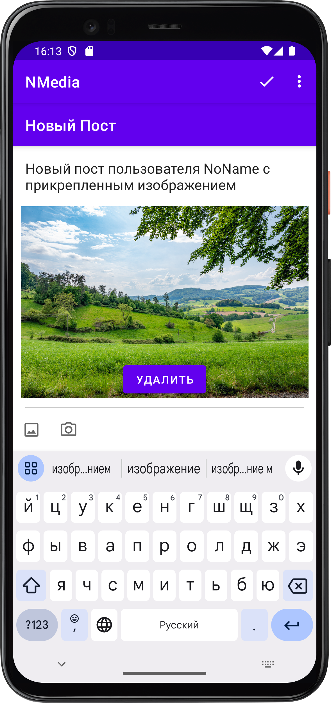
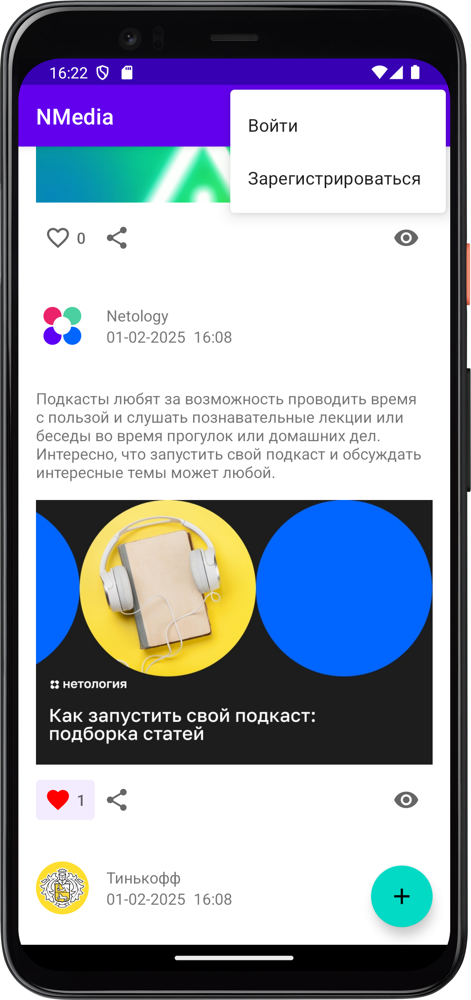
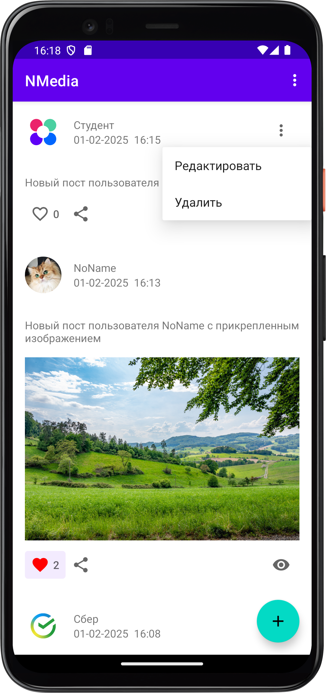
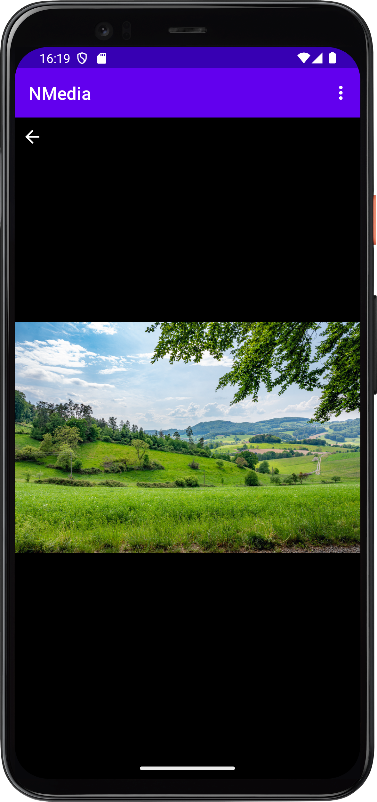

## Мобильное приложение NMedia

Приложение представляет собой социальную сеть, которая позволяет пользователям просматривать ленту постов, создавать посты, редактировать и удалять их, отмечать понравившиеся посты, делиться их текстами. 

Для получения уведомлений необходимо при первом запуске предоставить приложению соответствующее разрешение.

Все страницы экрана содержат меню в AppBar, которое формируется в зависимости от состояния аутентификации пользователя: кнопки «Войти», «Выйти» и «Зарегистрироваться». 

### Основной экран приложения

- список постов, загружаемых с сервера
- кнопка +, нажатие ведёт на создание нового поста или диалог с предложением войти/зарегистрироваться.
- уведомление о свежих записях, по нажатию загружаются новые посты
- добавлены разделители постов по времени:
     - сегодня
     - вчера
     - на прошлой неделе
     - две недели назад
- реализована вставка рекламного объявления через каждые 5 постов

Карточка поста на основном экране включает:
- аватар автора поста;
- имя автора;
- дату и время публикации;
- кнопку лайка с количеством лайков;
- вложение, при наличии: видео или фото;
- ссылку, при наличии, с переходом в браузер; 
- кнопку контекстного меню с возможностью удаления или перехода к редактированию, в случае если текущий пользователь является автором;
- текст поста;
- кнопку "поделиться"; 
- иконку просмотров и их количество  

При нажатии на карточку поста осуществляется переход к фрагменту предпросмотра поста.  При нажатии на вложение осуществляется переход к фрагменту предпросмотра вложения.

### Экран входа в приложение

Используются поля ввода:
- логин;
- пароль.

В случае получения от сервера ответа с кодом 400 отображается соответствующее уведомление.

### Экран регистрации

Используются поля ввода:
- имя;
- логин;
- пароль;
- аватар — изображение в формате jpeg, png. Присутствует кнопка с возможностью выбора фото и её превью.

В случае получения от сервера ответа с кодом 400 отображается соответствующее уведомление.

### Экран создания/редактирования поста

На этот экран может попасть только авторизованный пользователь.

Экран содержит:
- поле ввода текста;
- кнопки выбора изображения: фото или галерея;
- кнопку сохранить в AppBar.

После создания поста следует возврат назад к списку постов.

В рамках проекта выполнены задания по следующим темам курса "Android разработчик":

### Программирование на Kotlin под Android

- Android Studio, SDK, эмулятор
- Ресурсы, View и ViewGroup
- ConstraintLayout
- Обработка событий в Android
- Архитектура: MVVM
- Отображение списков: RecyclerView
- CRUD: списки, добавление, удаление, изменение
- Material Design
- Intents
- Хранение данных
- Fragments, FragmentManager
- SQL и SQLite
- Библиотека Room
- Notifications & Pushes
  - [Push-Sender](https://github.com/bulashova/push-sender)

### Промышленная разработка под Android
  
- Сетевые запросы: Main Thread & Background
- Современные подходы работы с многопоточностью,  OkHttp
- Многопоточность в Android, Glide
- Retrofit (CRUD)
- Coroutines в Android
- Flow
- Загрузка и отображение изображений (ImagePicker)
- Регистрация, аутентификация и авторизация
- Рассылка и приём Push-уведомлений

### Продвинутая разработка под Android

- Dependency Injection - Dagger Hilt
- Architecture Components (часть 1), Paging
- Architecture Components (часть 2), RemoteMediator
- RecyclerView - продвинутое использование